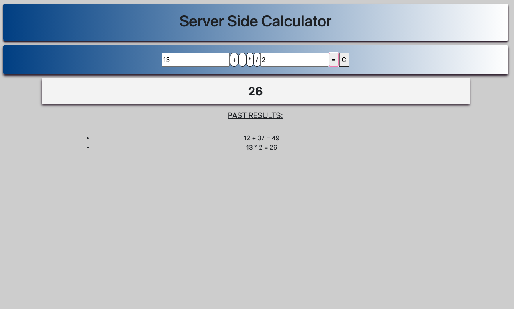

# SERVER SIDE CALCULATOR

## Description

_Duration: 48 Hours_

This is a Calculator class project completed during a weekend project sprint that processes the calculations on the server and presents them on the DOM. The base functionality of the calculator allows the user to make basic 2 number calculations with addition, subtraction, multiplication, or division. The results for each calculation will be displayed prominently and a list of all calculations made will be displayed after. 

## Screen Shot

### Prerequisites

## Installation

node
npm init --yes
npm install express
body parser

## Usage
How does someone use this application? Tell a user story here.

1. Once the file is opened in node, npm is initilized in the terminal and express is installed, we can open the calculator in localhost:5000 on our browser.
2. Calculations are made by entering a number in each input field, selecting an operator button, and selecting the equals button.
3. The equals button will submit the calculation and display the result below.
4. All calculations made on the calculator will be listed under PAST RESULTS.

## Built With

- html
- css
- javascript
- jquery

## Acknowledgement
Thanks to [Prime Digital Academy](www.primeacademy.io) who equipped and helped me to make this application a reality. Thank you Zhu Pod 2 for the project work leading up to this, helping lay the foundation for this project, and to Josh for seeing the detail I needed to finish the project.

## Support
If you have suggestions or issues, please email me at [trohde@rocketmail.com]
